# Дипломная работа по профессии «Системный администратор»

---

### Задача
Ключевая задача — разработать отказоустойчивую инфраструктуру для сайта, включающую мониторинг, сбор логов и резервное копирование основных данных. Инфраструктура должна размещаться в Yandex Cloud и отвечать минимальным стандартам безопасности: запрещается выкладывать токен от облака в git. Используйте инструкцию.

Перед началом работы над дипломным заданием изучите Инструкция по экономии облачных ресурсов.

Инфраструктура
Для развёртки инфраструктуры используйте Terraform и Ansible.

Не используйте для ansible inventory ip-адреса! Вместо этого используйте fqdn имена виртуальных машин в зоне ".ru-central1.internal". Пример: example.ru-central1.internal - для этого достаточно при создании ВМ указать name=example, hostname=examle !!

Важно: используйте по-возможности минимальные конфигурации ВМ:2 ядра 20% Intel ice lake, 2-4Гб памяти, 10hdd, прерываемая.

Так как прерываемая ВМ проработает не больше 24ч, перед сдачей работы на проверку дипломному руководителю сделайте ваши ВМ постоянно работающими.

Ознакомьтесь со всеми пунктами из этой секции, не беритесь сразу выполнять задание, не дочитав до конца. Пункты взаимосвязаны и могут влиять друг на друга.

Сайт
Создайте две ВМ в разных зонах, установите на них сервер nginx, если его там нет. ОС и содержимое ВМ должно быть идентичным, это будут наши веб-сервера.

Используйте набор статичных файлов для сайта. Можно переиспользовать сайт из домашнего задания.

Виртуальные машины не должны обладать внешним Ip-адресом, те находится во внутренней сети. Доступ к ВМ по ssh через бастион-сервер. Доступ к web-порту ВМ через балансировщик yandex cloud.

Настройка балансировщика:

Создайте Target Group, включите в неё две созданных ВМ.

Создайте Backend Group, настройте backends на target group, ранее созданную. Настройте healthcheck на корень (/) и порт 80, протокол HTTP.

Создайте HTTP router. Путь укажите — /, backend group — созданную ранее.

Создайте Application load balancer для распределения трафика на веб-сервера, созданные ранее. Укажите HTTP router, созданный ранее, задайте listener тип auto, порт 80.

Протестируйте сайт curl -v <публичный IP балансера>:80

Мониторинг
Создайте ВМ, разверните на ней Zabbix. На каждую ВМ установите Zabbix Agent, настройте агенты на отправление метрик в Zabbix.

Настройте дешборды с отображением метрик, минимальный набор — по принципу USE (Utilization, Saturation, Errors) для CPU, RAM, диски, сеть, http запросов к веб-серверам. Добавьте необходимые tresholds на соответствующие графики.

Логи
Cоздайте ВМ, разверните на ней Elasticsearch. Установите filebeat в ВМ к веб-серверам, настройте на отправку access.log, error.log nginx в Elasticsearch.

Создайте ВМ, разверните на ней Kibana, сконфигурируйте соединение с Elasticsearch.

Сеть
Разверните один VPC. Сервера web, Elasticsearch поместите в приватные подсети. Сервера Zabbix, Kibana, application load balancer определите в публичную подсеть.

Настройте Security Groups соответствующих сервисов на входящий трафик только к нужным портам.

Настройте ВМ с публичным адресом, в которой будет открыт только один порт — ssh. Эта вм будет реализовывать концепцию bastion host . Синоним "bastion host" - "Jump host". Подключение ansible к серверам web и Elasticsearch через данный bastion host можно сделать с помощью ProxyCommand . Допускается установка и запуск ansible непосредственно на bastion host.(Этот вариант легче в настройке)

Исходящий доступ в интернет для ВМ внутреннего контура через NAT-шлюз.

Резервное копирование
Создайте snapshot дисков всех ВМ. Ограничьте время жизни snaphot в неделю. Сами snaphot настройте на ежедневное копирование.

### Архитектура решения

Стенд развёрнут в одном VPC с разделением на публичные и приватные подсети.

### Публичный контур

- bastion — административный доступ по SSH
- zabbix — сервер мониторинга с web UI
- kibana — web UI для просмотра логов
- ALB — публикация web-приложения наружу

### Приватный контур

- web-a — web-сервер nginx
- web-b — web-сервер nginx
- elastic — сервер Elasticsearch

### Взаимодействие компонентов

- SSH-доступ выполняется через bastion
- ALB балансирует трафик между web-a и web-b
- Zabbix мониторит bastion, web-a, web-b, elastic, kibana
- Filebeat собирает nginx access/error logs с web-a и web-b и отправляет их в Elasticsearch
- Kibana используется для просмотра логов
- Для всех ВМ настроено ежедневное резервное копирование через snapshot schedule

## Публичные адреса и ссылки

- Web через ALB: http://158.160.204.211
- Zabbix: http://93.77.190.163/zabbix/
- Kibana: http://89.169.183.108:5601
- Bastion SSH: 93.77.191.90

## Внутренние IP

- bastion — 10.10.10.10
- zabbix — 10.10.10.30
- elastic — 10.10.20.32
- kibana — 10.10.11.27
- web-a — 10.10.20.11
- web-b — 10.10.30.21

## Список ресурсов

### ВМ

- bastion
- web-a
- web-b
- zabbix
- elastic
- kibana

### Сетевые ресурсы

- VPC network
- public-a
- public-b
- private-a
- private-b
- NAT Gateway
- private route table

### Security Groups

- yc-diplom-sg-bastion
- yc-diplom-sg-web
- yc-diplom-sg-zabbix
- yc-diplom-sg-elastic
- yc-diplom-sg-kibana
- yc-diplom-sg-alb

### Балансировка

- target group
- backend group
- http router
- virtual host
- application load balancer

### Backup

- snapshot schedule yc-diplom-daily-snapshots

## Terraform

Инфраструктура описана Terraform-кодом:

- сеть
- NAT Gateway
- route table
- Security Groups
- виртуальные машины
- ALB
- snapshot schedule

## Ansible

Конфигурация серверов выполняется через Ansible:

- базовая настройка хостов
- установка и настройка nginx
- установка Zabbix server
- установка Zabbix agents
- установка Docker
- запуск Elasticsearch и Kibana в Docker
- настройка Filebeat

## Мониторинг

Развёрнут Zabbix server. На bastion, web-a, web-b, elastic и kibana установлены агенты

Собран USE-dashboard, включающий:

- CPU
- RAM
- Disk
- HTTP requests/sec
- Active connections
- Connections by state
- Network traffic
- Problems / Trigger overview

## Логи

Развёрнут стек:

- Elasticsearch
- Kibana
- Filebeat

Filebeat собирает nginx access/error logs с web-серверов и отправляет их в Elasticsearch. Логи доступны в Kibana через Discover

## Резервное копирование

Настроено расписание snapshot:

- имя: yc-diplom-daily-snapshots
- запуск: ежедневно
- хранение: 7 дней

## Подтверждение работоспособности ресурсов

Для ресурсов, к которым неудобно предоставлять прямой доступ, приложены:

- скриншоты
- команды проверки
- stdout/stderr
- вывод сервисных команд

## Web через ALB

Команда проверки (Windows PowerShell):

curl.exe -I http://158.160.204.211

## Структура репозитория

terraform/
ansible/
docs/
site/
README.md
.gitignore

---

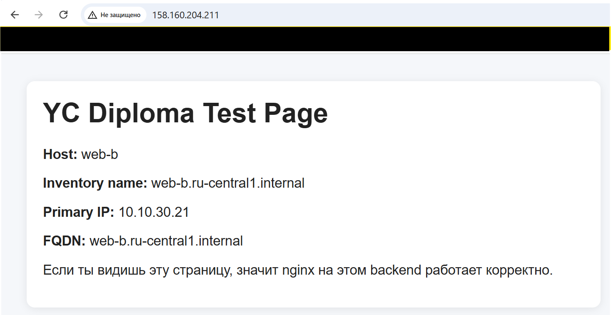

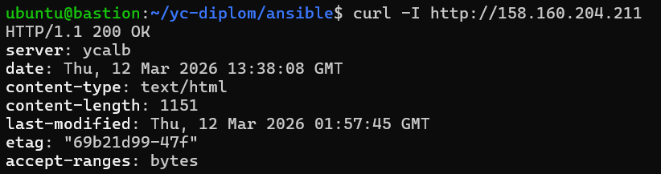

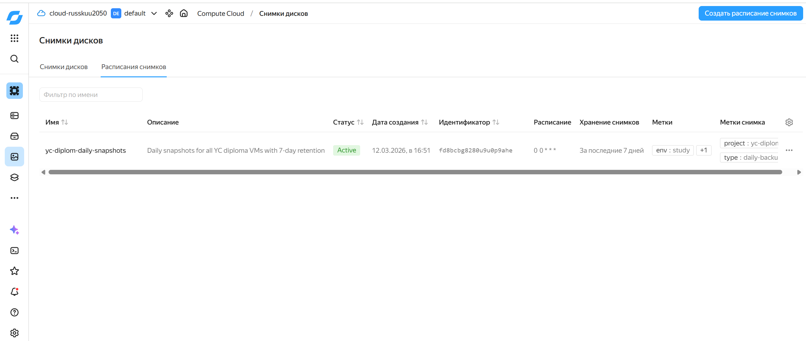

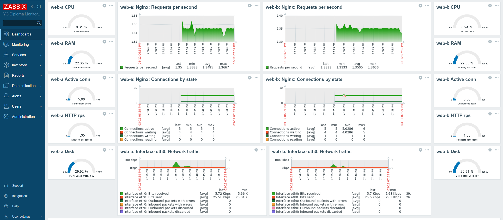

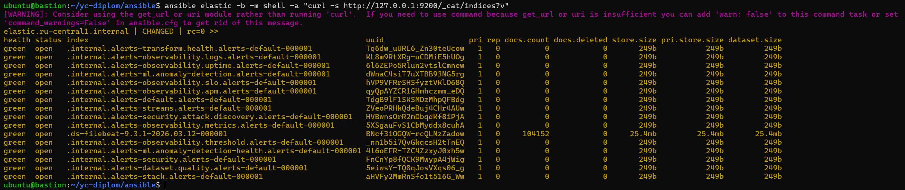

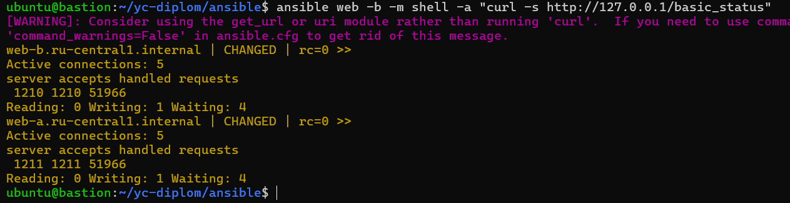

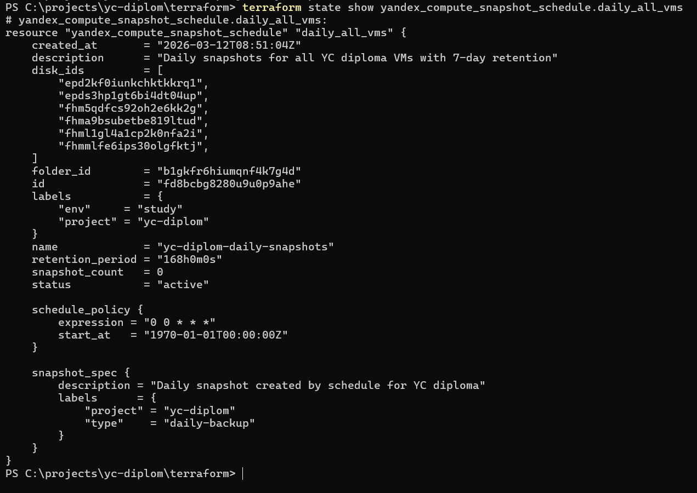

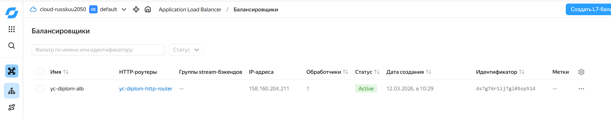

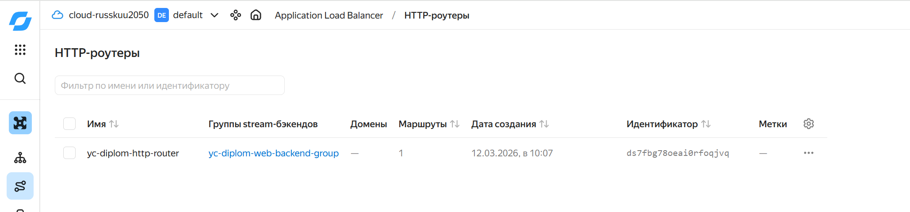

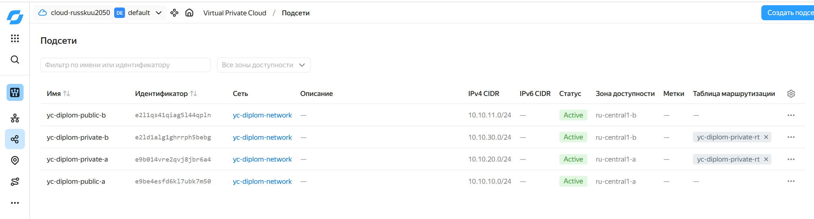

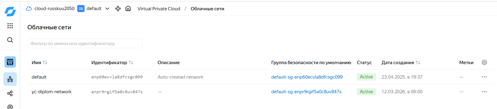

