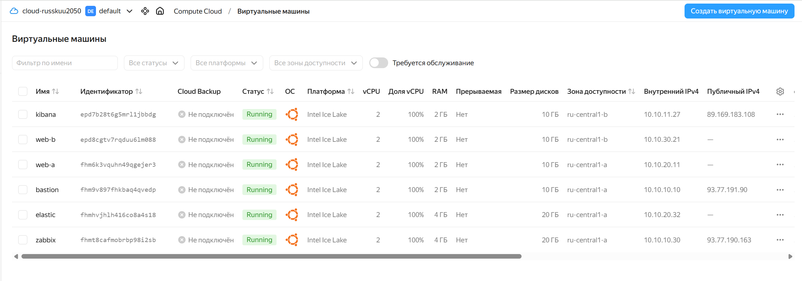
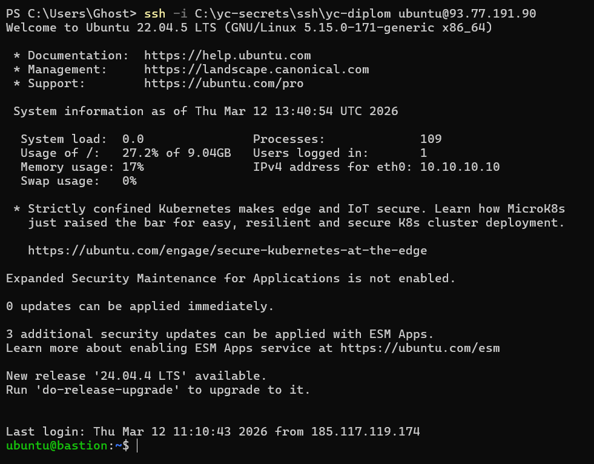
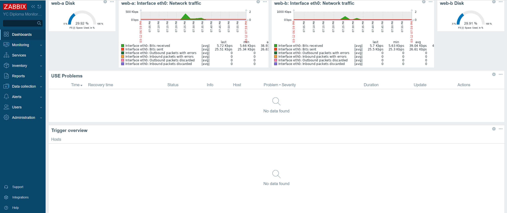
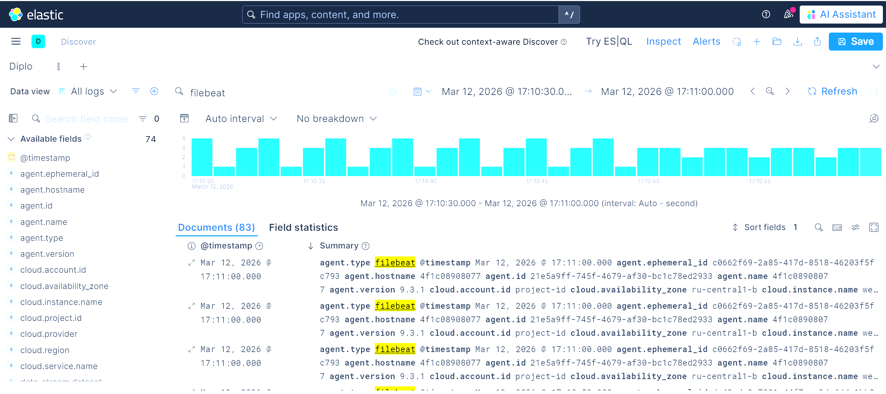
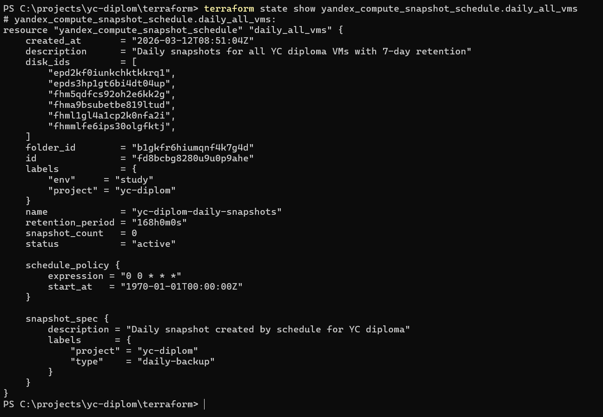
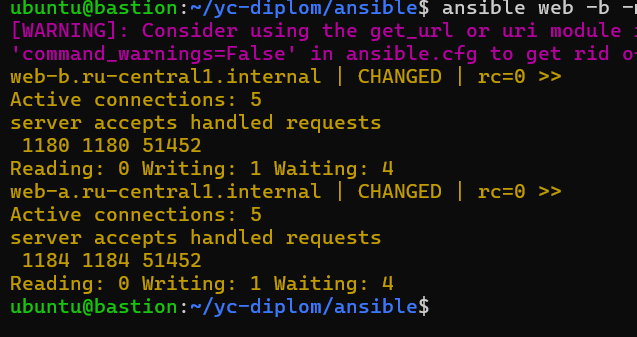

\# YC Diploma


\## Цель работы

Развернуть в Yandex Cloud инфраструктурный стенд с использованием Terraform и Ansible, включающий:

\- bastion host;

\- 2 web-сервера с nginx;

\- Application Load Balancer;

\- Zabbix server и Zabbix agents;

\- Elasticsearch + Kibana + Filebeat;

\- ежедневные snapshot с хранением 7 дней.


\## Архитектура решения

Стенд развёрнут в одном VPC с разделением на публичные и приватные подсети.


\### Публичный контур

\- \*\*bastion\*\* — административный доступ по SSH;

\- \*\*zabbix\*\* — сервер мониторинга с web UI;

\- \*\*kibana\*\* — web UI для просмотра логов;

\- \*\*ALB\*\* — публикация web-приложения наружу.


\### Приватный контур

\- \*\*web-a\*\* — web-сервер nginx;

\- \*\*web-b\*\* — web-сервер nginx;

\- \*\*elastic\*\* — сервер Elasticsearch.


\### Взаимодействие компонентов

\- SSH-доступ выполняется через bastion;

\- ALB балансирует трафик между web-a и web-b;

\- Zabbix мониторит bastion, web-a, web-b, elastic, kibana;

\- Filebeat собирает nginx access/error logs с web-a и web-b и отправляет их в Elasticsearch;

\- Kibana используется для просмотра логов;

\- Для всех ВМ настроено ежедневное резервное копирование через snapshot schedule.


\## Публичные адреса и ссылки

\- \*\*Web через ALB\*\*: `http://158.160.204.211`

\- \*\*Zabbix\*\*: `http://93.77.190.163/zabbix/`

\- \*\*Kibana\*\*: `http://89.169.183.108:5601`

\- \*\*Bastion SSH\*\*: `93.77.191.90`


\## Внутренние IP

\- bastion — `10.10.10.10`

\- zabbix — `10.10.10.30`

\- elastic — `10.10.20.32`

\- kibana — `10.10.11.27`

\- web-a — `10.10.20.11`

\- web-b — `10.10.30.21`


\## Список ресурсов

\### ВМ

\- bastion

\- web-a

\- web-b

\- zabbix

\- elastic

\- kibana


\### Сетевые ресурсы

\- VPC network

\- public-a

\- public-b

\- private-a

\- private-b

\- NAT Gateway

\- private route table


\### Security Groups

\- yc-diplom-sg-bastion

\- yc-diplom-sg-web

\- yc-diplom-sg-zabbix

\- yc-diplom-sg-elastic

\- yc-diplom-sg-kibana

\- yc-diplom-sg-alb


\### Балансировка

\- target group

\- backend group

\- http router

\- virtual host

\- application load balancer


\### Backup

\- snapshot schedule `yc-diplom-daily-snapshots`


\## Terraform

Инфраструктура описана Terraform-кодом:

\- сеть;

\- NAT Gateway;

\- route table;

\- Security Groups;

\- виртуальные машины;

\- ALB;

\- snapshot schedule.


\## Ansible

Конфигурация серверов выполняется через Ansible:

\- базовая настройка хостов;

\- установка и настройка nginx;

\- установка Zabbix server;

\- установка Zabbix agents;

\- установка Docker;

\- запуск Elasticsearch и Kibana в Docker;

\- настройка Filebeat.


\## Мониторинг

Развёрнут Zabbix server. На bastion, web-a, web-b, elastic и kibana установлены агенты. Собран USE-dashboard, включающий:

\- CPU;

\- RAM;

\- Disk;

\- HTTP requests/sec;

\- Active connections;

\- Connections by state;

\- Network traffic;

\- Problems / Trigger overview.


\## Логи

Развёрнут стек:

\- Elasticsearch;

\- Kibana;

\- Filebeat.


Filebeat собирает nginx access/error logs с web-серверов и отправляет их в Elasticsearch. Логи доступны в Kibana через Discover.


\## Резервное копирование

Настроено расписание snapshot:

\- имя: `yc-diplom-daily-snapshots`;

\- запуск: ежедневно;

\- хранение: 7 дней.


\## Подтверждение работоспособности ресурсов

Для ресурсов, к которым неудобно предоставлять прямой доступ, приложены:

\- скриншоты;

\- команды проверки;

\- stdout/stderr;

\- вывод сервисных команд.


Подробности см. в \[docs/checks.md](docs/checks.md).


\## Скриншоты


\### USE Dashboard

!\[USE Dashboard](docs/screenshots/06-use-dashboard.png)


\### Kibana Discover

!\[Kibana Discover](docs/screenshots/07-kibana-discover.png)


\### Snapshot Schedule

!\[Snapshot Schedule](docs/screenshots/09-snapshot-schedule.png)


\## Структура репозитория

```text

terraform/

ansible/

docs/

site/

README.md

.gitignore


# Проверка работоспособности ресурсов

## 1. Web через ALB
Команда:
bash
curl -I http://158.160.204.211


## Скриншоты и подтверждение работы стенда

### 1. Список виртуальных машин


### 2. Web через Application Load Balancer


### 3. Проверка web через ALB командой curl


### 4. Подключение к bastion по SSH


### 5. Хосты в Zabbix


### 6. USE Dashboard — общий вид


### 7. USE Dashboard — детальная часть


### 8. Kibana Discover


### 9. Проверка Elasticsearch


### 10. nginx stub_status


### 11. Snapshot schedule


### 12. Проверка nginx stub_status


### 13. Проверка snapshot schedule

